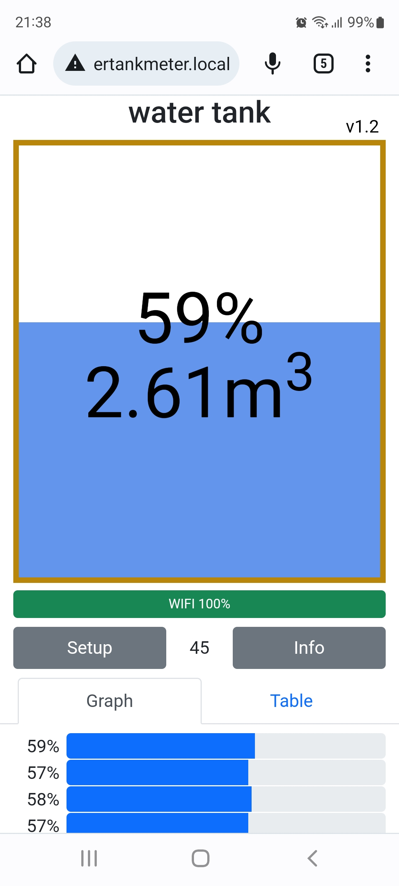
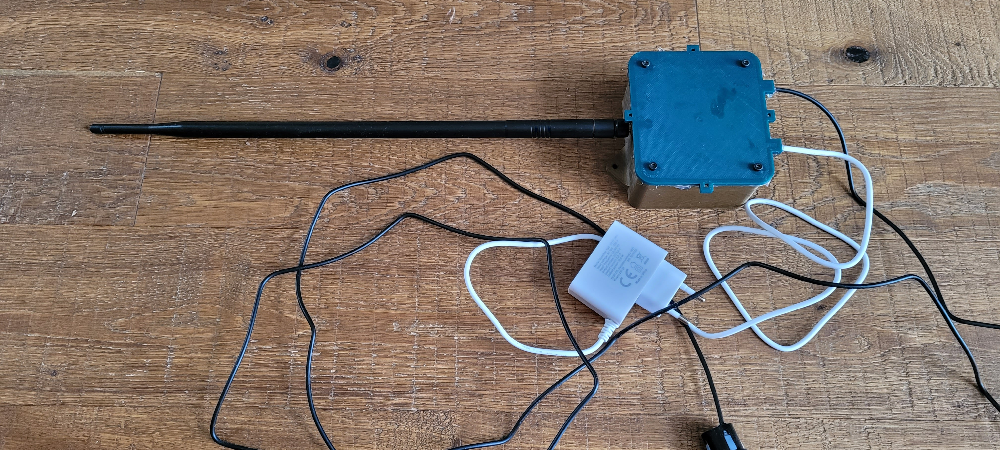
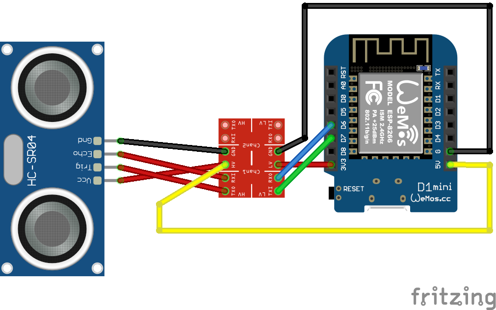
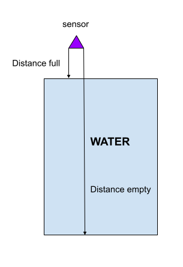

# Water tank meter

ESP8266 based project for measuring water level in tank using ultrasonic sensor complete with 3D printed enclosure accesible through web interface.

## Dependencies
* https://arduino-esp8266.readthedocs.io/en/latest/installing.html
* ArduinoJson
* StreamUtils
* https://github.com/me-no-dev/ESPAsyncTCP/archive/refs/heads/master.zip
* https://github.com/me-no-dev/ESPAsyncWebServer/archive/refs/heads/master.zip

## Wiring diagram

## Electronics parts
* WeMos D1 Mini Pro 16MB ESP8266 WiFi modul (pro model to attach pigtail+antenna)
* Logic level shifter
* JSN-SR04T 
* MaxLink omnidirectional dipole antenna 10dBi 2,4GHz, RSMA 01-VS-MDB10
* pigtail
* USB charger - micro usb
* 4 M3 threaded inserts
* 4 M3x10 screws
* cables for wiring
* solder if needed

## Setup

* compile and upload firmware + static files ([how to](https://arduino-esp8266.readthedocs.io/en/latest/filesystem.html#uploading-files-to-file-system))
* on first boot, the board sets up WIFI AP with  default "watertankmeter" SSID and "watertankmeter.local" address
* connect and setup WIFI and tank dimensions and sensor distances
* NOTICE: minimum full distance is 20cm - which is the minimum distance the sensor can measure
* Better to keep the sensor at least 30cm above the maximum water level
* The logic of distances on picture below

