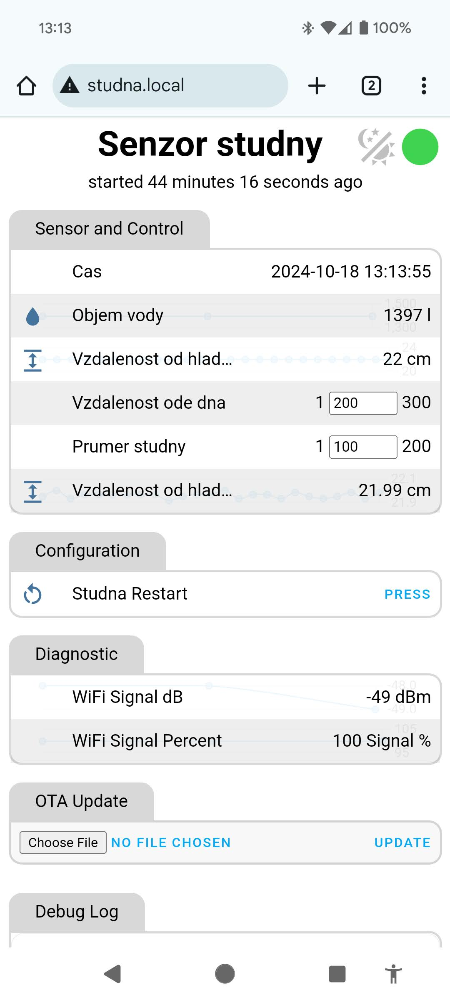
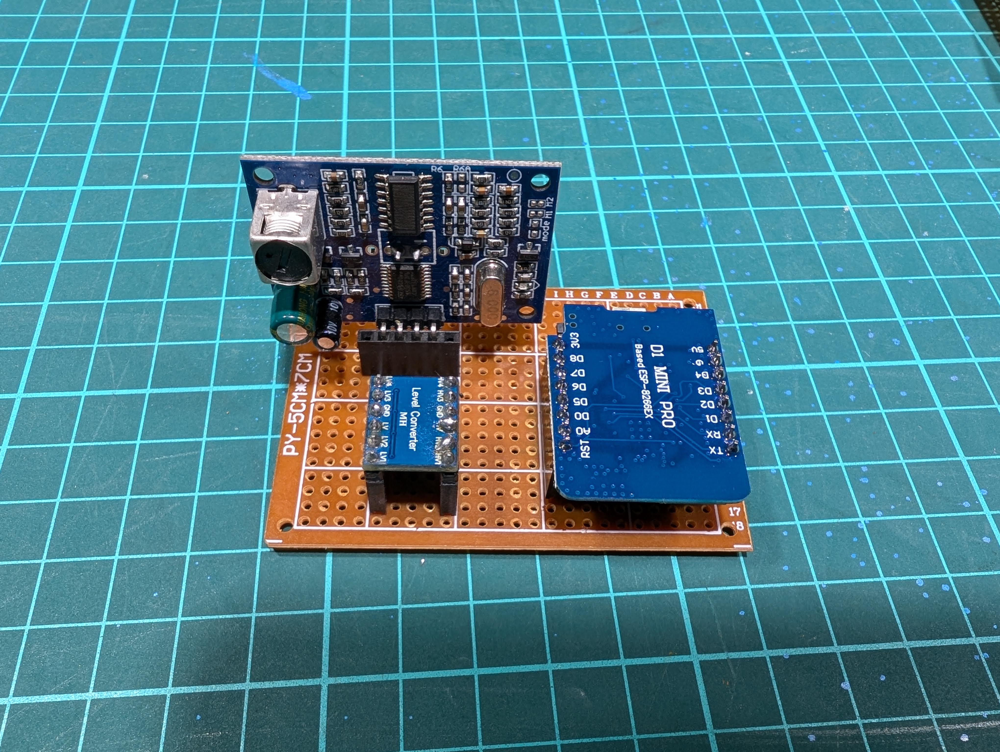
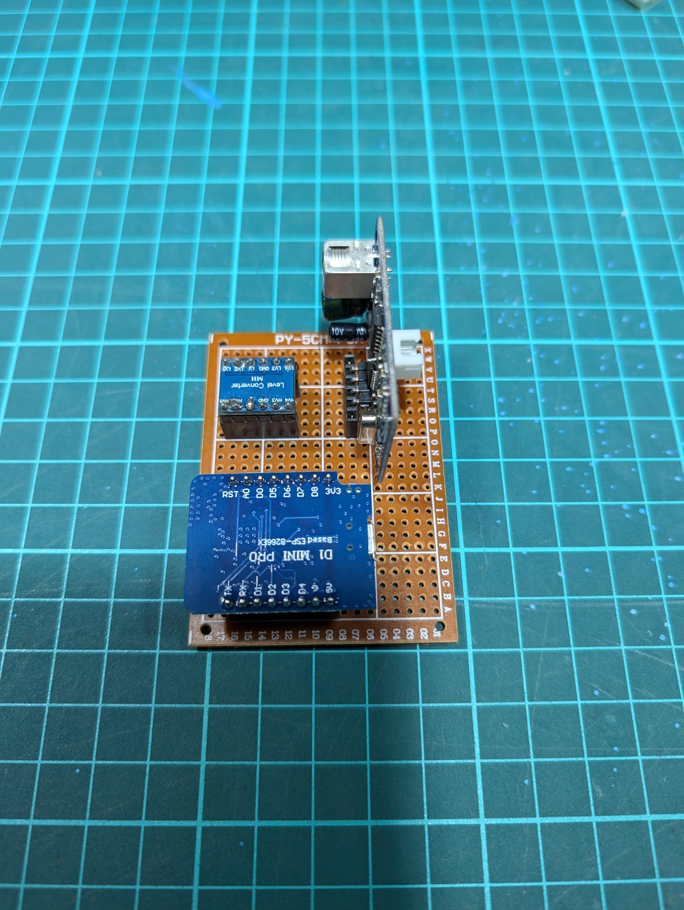
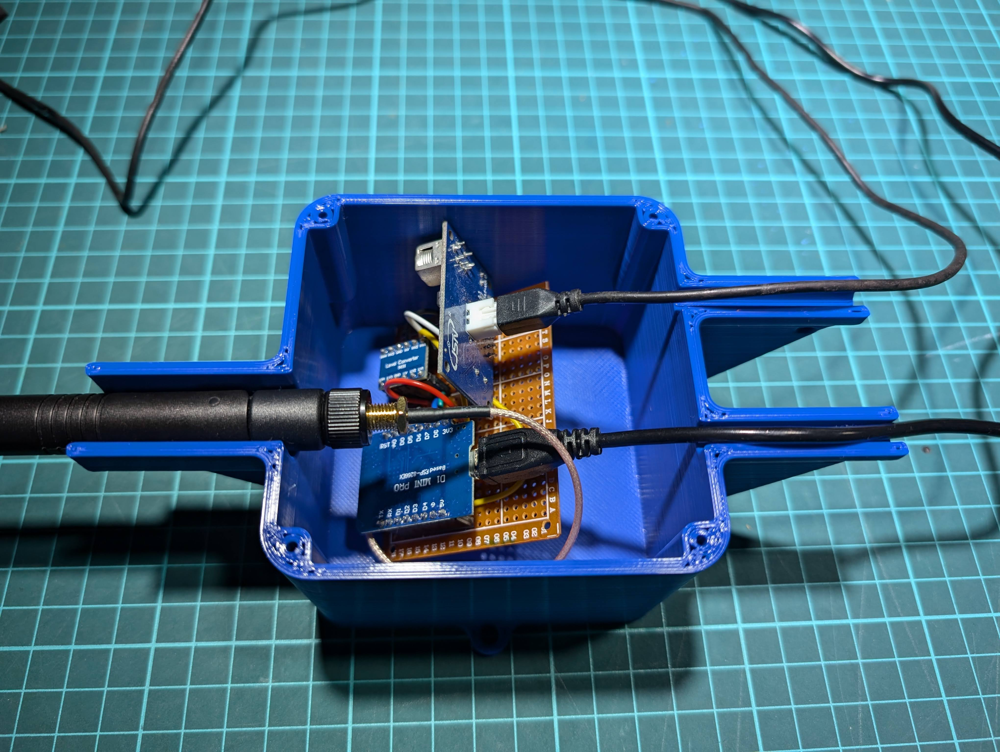
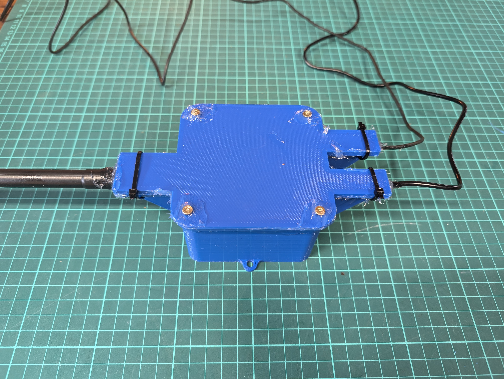
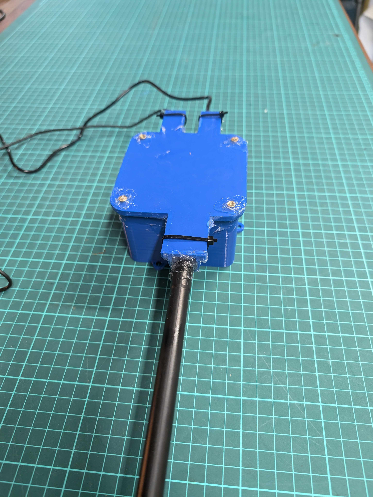

# Water tank meter

ESP8266 based project for measuring water level in tank using ultrasonic sensor complete with 3D printed enclosure accesible through web interface.


You need to install [ESPHome](https://esphome.io/)
```
esphome run studna.yaml
```

## Hardware
* [WeMos D1 Mini Pro 16MB ESP8266 WiFi modul](https://www.laskakit.cz/wemos-d1-mini-pro--esp8266-wifi-modul/)
* [Bi-Directional Logic Level Converter (4 Channel) 5v 3.3v](https://www.laskakit.cz/4-kanaly-obousmerny-prevodnik-logickych-urovni-5v-a-3-3v/)
* [Pigtail U.FL - RP-SMA Female, kabel 1,15mm, 15cm](https://www.laskakit.cz/pigtail-u-fl-rp-sma-female--kabel-1-13mm--18cm/)
* [MaxLink alldirection anthena, 10dBi, 2.4GHz, RSMA](https://www.suntech.cz/maxlink-vsesmerova-antena-10dbi-2-4ghz-rsma_d152907.html)
* [microUSB charger](https://www.laskakit.cz/napajeci-adapter-sitovy-3a-5v-pro-raspberry-pi-microusb/)
* [prototype pcb board](https://www.laskakit.cz/50x70mm-pcb-prototypova-deska/)

## Wiring diagram


## Photo details








